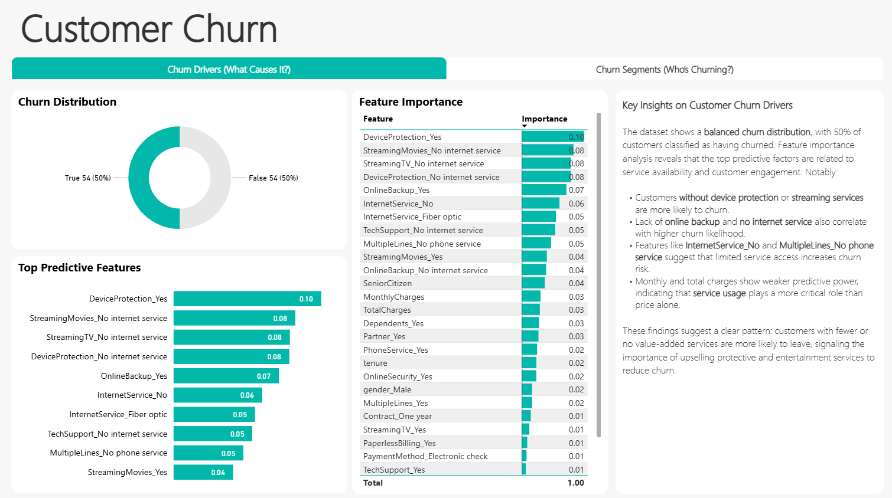
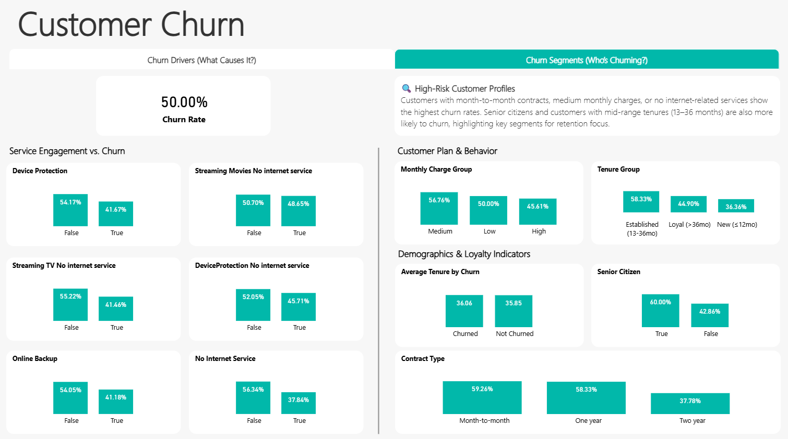

# 📉 Customer Churn Prediction

This end-to-end project predicts customer churn using machine learning (XGBoost) and visualizes insights with Power BI. It covers data cleaning, feature engineering, modeling, and the creation of a business-ready dashboard to identify key churn drivers and at-risk customer segments.

---

## 🧠 Problem Statement

Customer churn affects recurring revenue and business growth. By predicting churn based on behavioral and demographic patterns, companies can act early to retain valuable customers.

---

## 🛠️ Tech Stack

- **Python**: pandas, scikit-learn, XGBoost
- **Jupyter Notebooks**: EDA, preprocessing, modeling
- **Power BI**: executive dashboard with interactive insights
- **Git & GitHub**: version control and project tracking

---

## 📁 Project Structure

```
customer-churn-prediction/
├── data/ # CSV files (raw, cleaned, and feature importance)
├── notebooks/ # Jupyter notebooks for each stage
├── models/ # Model artifacts
├── reports/ # Power BI report (.pbix) and screenshots
├── src/ # Python utility scripts
└── README.md # Project overview
```

---

## 📊 Power BI Dashboard

> Final business report includes two pages:
- **Churn Drivers**: Feature importance, top drivers, and churn distribution
- **Churn Segments**: Key customer profiles based on service usage, contracts, and demographics

📸 **Screenshots**:  
  


📂 **File**: [`customer_churn_report.pbix`](./reports/customer_churn_report.pbix)

---

## 🚀 Key Insights

- The model achieved **89% accuracy** using XGBoost.
- Customers without device protection or streaming services are more likely to churn.
- Those on **month-to-month contracts** and with **medium charges** are at the highest risk.
- Senior citizens and customers in their **13–36 month tenure window** also show high churn rates.

---

## 🔮 Next Steps

- Integrate with Power BI REST API for auto-refresh and alerts.
- Deploy as a predictive service via Azure Functions or Streamlit.
- Expand to lifetime value (LTV) modeling.

---

## 🏅 Author & Certifications

**Felipe Castro**  
Analytics Engineer @ EPAM Systems

📜 [PL-300: Power BI Data Analyst](https://learn.microsoft.com/api/credentials/share/en-us/FelipeCastro-8026/F853AABE365874B3?sharingId=13D660F56C1DFFA3)  
📜 [DP-600: Fabric Analytics Engineer](https://learn.microsoft.com/api/credentials/share/en-us/FelipeCastro-8026/6C5A2F5A8A5864FC?sharingId=13D660F56C1DFFA3)

---

## 🧰 Tools & Libraries


